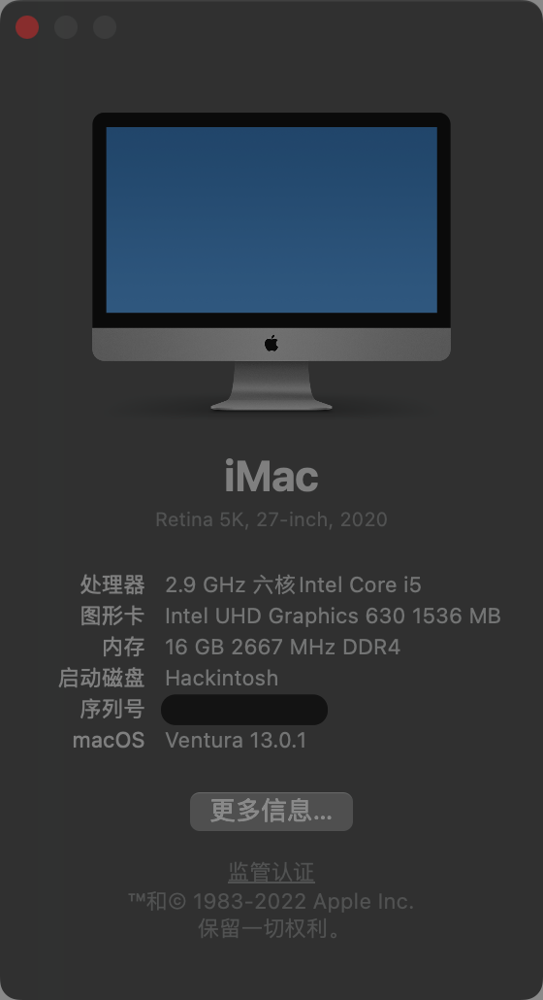

## 使用

通过 GenSMBIOS 生成新的三码，替换 /EFI/OC/config.plist 文件中

```xml
<dict>
    <key>SystemSerialNumber</key>
    <string>W00000000001</string>
</dict>
```
```xml
<dict>
    <key>MLB</key>
    <string>M0000000000000001</string>
</dict>
```
```xml
<dict>
    <key>SystemUUID</key>
    <string>00000000-0000-0000-0000-000000000000</string>
</dict>
```

## 配置

| 配件 | 型号 |
| ---- | ---  |
| CPU  | i5 10400 散片 |
| 内存 | 2666 16x2（金士顿） |
| 主板 | 华擎 B460M ITX 702 |
| 硬盘 | 三星 500GB M.2 NVMe 970 EVO Plus |
| 显卡 | iGPU |
| 显示器 | DELL U2718Q |
| CPU风扇 | 酷冷至尊 T520 |
| 电源 | SFX 500W（全汉 MS500 无模组线） |
| 机箱 | Formula X1（Ghost s1 六水复刻版） |
| 无线网卡 | BCM94360CS2 |

## 功能

#### 正常

+ MacOS Big Sur
+ 接力、随航；（如接力有问题，退出所有设备的 icloud 账号，重新登陆）
+ 夜览；
+ 音量调节；
+ 显示器亮度调节（通过 MonitorControl ）；
+ CPU 变频；
+ 视频硬解码；
+ 网卡；
+ ...

#### 问题

1. 休眠后，cpu 风扇未停；

## 版本

| 驱动 | 说明 |
| ---- | ---- |
| OpenRuntime.efi | 运行环境 |
| OpenCanopy.efi | 图形化界面 |
| CrScreenshotDxe.efi | UEFI截图工具 |
| [HfsPlus.efi](https://github.com/acidanthera/OcBinaryData/tree/master/Drivers) | HFS |

| 组件 | 说明 | 版本 |
| ---- | ---- | ---- |
| [OpenCore](https://github.com/acidanthera/OpenCorePkg/releases) | 引导程序 | 0.6.3 |
| [Lilu](https://github.com/acidanthera/Lilu) | 内核扩展 | 1.4.9-RELEASE |
| [CPUFriend](https://github.com/acidanthera/CPUFriend) | 电源管理 | 1.2.2-RELEASE |
| [VirtualSMC & SMCProcessor & SMCSuperIO](https://github.com/acidanthera/VirtualSMC) | SMC模拟器 | 1.1.8-RELEASE |
| [WhateverGreen](https://github.com/acidanthera/WhateverGreen) | 显卡（GPU） | 1.4.4-RELEASE |
| [AppleALC](https://github.com/acidanthera/AppleALC) | 声卡驱动 | 1.5.4-RELEASE |
| [IntelMausi](https://github.com/acidanthera/IntelMausi) | Intel网卡（LAN）驱动 | 1.0.4-RELEASE |
| [NVMeFix](https://github.com/acidanthera/NVMeFix) | NVMe存储驱动 | 1.0.4-RELEASE |
| [USBInjectAll](https://github.com/daliansky/OS-X-USB-Inject-All) | USB | 0.7.6-RELEASE |
| [XHCI-unsupported](https://github.com/daliansky/OS-X-USB-Inject-All) | USB | master |
| [MonitorControl](https://github.com/MonitorControl/MonitorControl/releases) | 显示器亮度控制 | 2.1.0 |
| USBPorts.kext | USB 定制 | - |

## 主题

可在 github 上通过 OpenCanopy 关键词搜索获得，下载后替换 EFI/OC/Resources/Image 下文件。

+ 默认主题
    - https://github.com/acidanthera/OcBinaryData
+ blackosx
    - https://github.com/blackosx/OpenCanopyIcons
    - https://github.com/blackosx/OpenCanopyIconPacks
    - https://github.com/blackosx/OpenCanopyIcons-CC0
+ https://github.com/pkdesign/OpenCanopyIcons
+ https://github.com/khronokernel/OpenCanopy-Big-Sur

## 制作工具

| 工具 | 说明 | 版本 |
| ---- | ---- | ---- |
| [Python](https://www.python.org/downloads/) | 基础软件；制作工具运行需要； | 3.9.0 |
| [7Zip](https://www.7-zip.org/download.html) | 基础软件；gibMacOS 运行需要 | 15.14 |
| [gibMacOS](https://github.com/corpnewt/gibMacOS) | Mac下载 & U盘制作 | master |
| [SSDTTime](https://github.com/corpnewt/SSDTTime) | SSDTs 制作 | master |
| [GenSMBIOS](https://github.com/corpnewt/GenSMBIOS) | SMBIOS 制作 | master |
| [ProperTree](https://github.com/corpnewt/ProperTree) | OpenCore 配置文件编辑工具 | master |
| [Hackintool](https://github.com/headkaze/Hackintool/releases) | 黑苹果 & USB定制 | 3.4.7 |

**注1** 整体制作环境为 Windows；

**注2** Python 需添加至环境变量 PATH；

**注2** 如 7-ZIP 非默认安装路径，可以修改 gibMacOS 的 MakeInstall.py 文件
```python
self.z_path64 = os.path.join(os.environ['SYSTEMDRIVE'] + "\\", "Program Files", "7-Zip", "7z.exe")
```

## 测试工具

| 工具 | 说明 | 版本 |
| ---- | ---- | ---- |
| [Intel-Power-Gadget](https://software.intel.com/content/www/us/en/develop/articles/intel-power-gadget.html) | CPU 变频&功率监控 | 3.7.0 |
| [VideoProc](https://www.videoproc.com/download-record-video/) | 视频硬解码测试 | 3.9 |
| [Geekbench](https://www.geekbench.com/download/) | 性能测试 | 5.2.5 |
| [Cinebench](https://www.maxon.net/en/cinebench) | 性能测试 | R20 |

## 参考

+ B站 司波图 视频教程
    - https://www.bilibili.com/video/BV1uf4y1X7MT

+ OpenCore 手册
    - 官方手册 https://github.com/acidanthera/OpenCorePkg/blob/master/Docs/Configuration.pdf
    - Dortania 制作的安装手册 https://dortania.github.io/OpenCore-Install-Guide/
    - 中文 https://oc.skk.moe/

+ https://github.com/WenvyG/ASRock-B460M-ITX-ac-Hackintosh

+ https://github.com/ansonliao/Asrock-B460m-ITX-AC-OC-EFI
